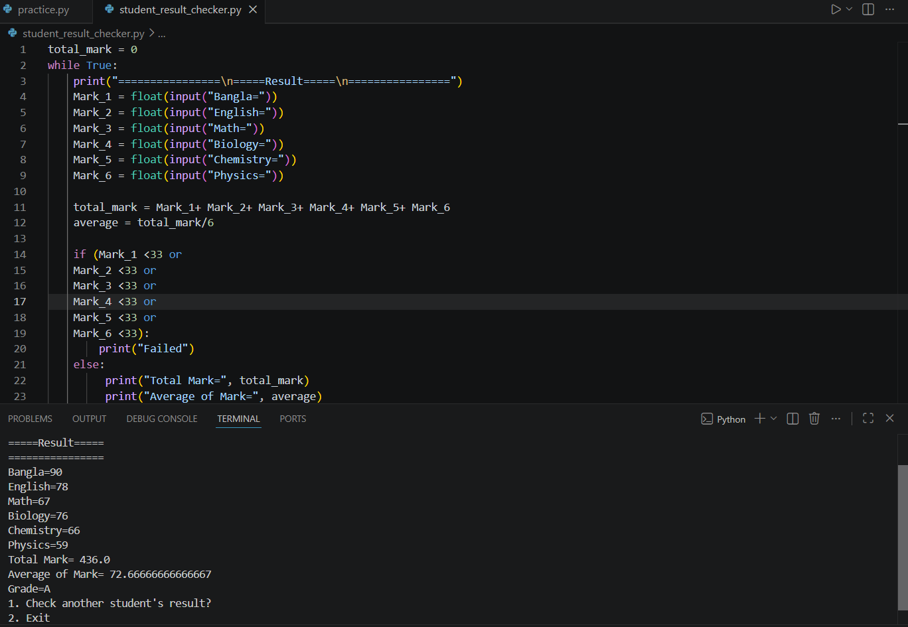

# Student Result Management System

A simple Python console application that calculates a student's total marks, average, and grade based on marks obtained in six subjects.

## Features

- Calculate total marks
- Calculate average
- Determine pass/fail
- Assign grades (A+, A, B, C, D, F)
- Check results for multiple students

## Technologies Used

- Python

## How to Run

```bash
python student_result_checker.py
```

## Output


